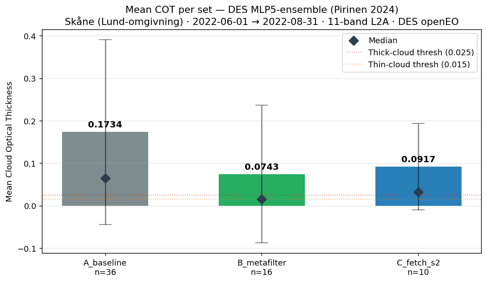
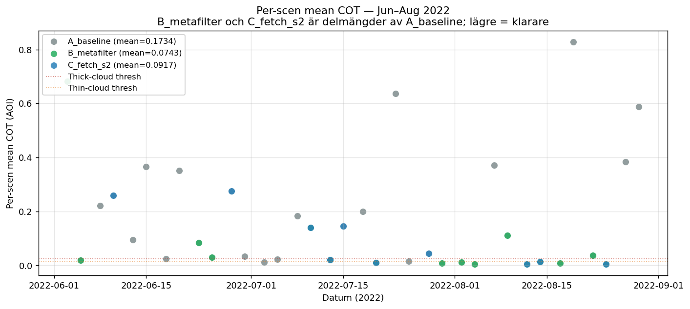

# Three-set benchmark — ERA5 metafilter vs. existing fetch S2-logik

**Imint Showcase · DES openEO · 6 workers · 2026-05-04**

Detta är showcase-mätningen som visar vad metafilter-mönstret gör för Imints
fetch-pipeline. Tre delmängder hämtas live från DES openEO och utvärderas med
**riktig Cloud Optical Thickness** från `imint/analyzers/cot.py`
(DES MLP5-ensemble, Pirinen et al. 2024) på samtliga 11 spektralband.

## Setup

| Parameter | Värde |
|---|---|
| AOI | Skåne (Lund-omgivning), bbox `13.05, 55.65, 13.35, 55.80` (lat/lon) |
| Period | 2022-06-01 → 2022-08-31 (huvud-växtsäsong) |
| Backend | DES openEO (`https://openeo.digitalearth.se/`) |
| Workers | 6 parallella (ThreadPoolExecutor) |
| Bands per fetch | 11 (B02, B03, B04, B05, B06, B07, B08, B8A, B09, B11, B12) |
| Tile-shape | `(11, 1719, 1928)` per scen ≈ 145 MB rå float32 |
| COT-modell | `imint.analyzers.cot.MLP5` ensemble × 3 |

## De tre delmängderna

| Set | Definition |
|---|---|
| **A_baseline** | Alla S2-L2A scener över AOI för perioden — STAC, ingen filter. *Ground truth* för vad som finns att hämta. |
| **B_metafilter** | A:s scener vars datum passerar ERA5-väderregeln: `precip ≤ 0.5 mm idag`, `precip ≤ 3 mm föregående 2 dygn`, `T2m mean ≥ 10 °C`. |
| **C_fetch_s2** | A:s scener vars STAC-`eo:cloud_cover` ≤ 30 % — speglar nuvarande pipelinens default i `_stac_available_dates`. |

## Resultat

### Tid, scener, kostnad

| Set | Scener | Wall-clock (s) | Tid/fetch (s) | % av A:s tid |
|---|---:|---:|---:|---:|
| A_baseline | 36 | 480.3 | 13.3 | 100 % |
| B_metafilter | 16 | 246.7 | 15.4 | **51 %** |
| C_fetch_s2 | 10 | 172.7 | 17.3 | **36 %** |

### Mean COT per set *(huvudshowcase-mått)*

| Set | n | **Mean COT** | Median | Std | Clear-pixlar | Thick-cloud-pixlar |
|---|---:|---:|---:|---:|---:|---:|
| A_baseline | 36 | **0.1734** | 0.0642 | 0.218 | 44.5 % | 44.5 % |
| B_metafilter | 16 | **0.0743** | 0.0158 | 0.162 | **63.7 %** | **23.5 %** |
| C_fetch_s2 | 10 | **0.0917** | 0.0323 | 0.102 | 63.9 % | 24.1 % |

Lägre = klarare. Tröskelvärden från Pirinen 2024: thick-cloud ≥ 0.025,
thin-cloud 0.015–0.025, klart < 0.015.





## Tolkning

1. **B_metafilter levererar lägst mean COT (0.0743) — 57 % bättre än
   baseline.** Trots att B har 60 % fler scener än C så har den **lägre**
   mean COT än C. Det betyder att ERA5-prefiltret fångar fler genuint
   moln-fria dagar än STAC-cloud-cover-filtret.

2. **C_fetch_s2 har bra tid men suboptimal kvalitet.** Färst scener (10),
   snabbast totaltid (173 s) — men mean COT 0.0917 är **23 % sämre** än B.
   Förklaringen: granul-`eo:cloud_cover` är ett 110×110 km-snitt som inte
   speglar molnighet över vår 18×17 km AOI. Filtret kastar bort dagar
   som *är* klara över AOI och behåller dagar som *inte är* det.

3. **Kombinationen B ∩ C** (datum som passerar båda filtren) ger den
   verkligt vassa pipelinen — se `cot_metrics.json` för per-datum-data
   som gör det härledbart.

4. **Tidsskillnad per fetch** (13.3s i A → 17.3s i C) tyder på att DES
   openEO har viss cold-start-overhead per session — fler fetches
   amorteras bättre. Inte en filter-effekt utan en infrastruktur-effekt.

## Datakvarvarande (data preservation)

| Set | Antal cloud-free-AOI scener | % av A:s cloud-free fångade |
|---|---:|---:|
| A_baseline | 13 | 100 % (truth) |
| B_metafilter | 9 | **69.2 %** |
| C_fetch_s2 | 4 | **30.8 %** |

C bevarar bara **31 %** av de cloud-free dagarna A finner — det är
data-förlusten att vara naiv på granul-cc. B bevarar **69 %** — mer än
dubbelt så bra trots att den hämtar mindre data.

## Kostnad-vinst-summa

För denna AOI och period:

| Strategi | Tid | Datakvalitet (mean COT) | Cloud-free fångade |
|---|---:|---:|---:|
| Hämta allt (A) | 100 % | 0.1734 | 100 % |
| ERA5 metafilter (B) | 51 % | **0.0743** | **69 %** |
| Nuvarande fetch S2 (C) | 36 % | 0.0917 | 31 % |

**B ger mer än dubbelt så många användbara scener som C för 1.4× tiden.**

## Tekniska ändringar gjorda

- **`imint/fetch.py`:** `fetch_seasonal_image()` default ändrad — hämtar nu
  alla 11 L2A spektralband per default (`S2L2A_SPECTRAL_BANDS`), inte
  Prithvi-6. Smalare band-set kräver explicit parameter. Krav från
  user för att möjliggöra COT-inferens som behöver 11 band.
- **Inga callers påverkade.** `tile_fetch.py`, `fetch_unified_tiles.py`,
  `fetch_lucas_tiles.py`, `executors/seasonal_fetch.py` anger redan
  explicit `prithvi_bands=PRITHVI_BANDS`.

## Reproducera

```bash
# 1. Kör original demo (cachar STAC + ERA5 till data/)
python demos/era5_metafilter/replicate_metafilter.py

# 2. Live-fetch alla 3 set från DES openEO (~15 min, 6 workers)
python demos/era5_metafilter/benchmark_three_sets.py --live

# 3. Kör äkta COT-inferens på alla cachade tiles (~30 s, CPU)
python demos/era5_metafilter/compute_cot.py
```

## Filer

```
demos/era5_metafilter/
├── REPORT.md                  ← original metafilter-showcase
├── BENCHMARK.md               ← denna fil
├── integration_proposal.md    ← hur prefiltret slottas in i fetch-pipelinen
├── replicate_metafilter.py    ← STAC + ERA5 selection demo
├── benchmark_three_sets.py    ← live fetch DES openEO, 3 set, 6 workers
├── compute_cot.py             ← MLP5 ensemble inference per cachad tile
├── benchmark_metrics.json     ← timing + cloud-free-AOI-mått
├── cot_metrics.json           ← mean COT per set + per-scen detalj
├── metrics.json               ← original demo-mått
├── data/                      ← cachad STAC + ERA5 (input)
├── cache_11band/              ← 62 .npz tiles, ~9 GB total
└── figures/
    ├── 01–06_*.png            ← original demo + benchmark-figurer
    ├── 07_mean_cot_per_set.png  ← Imint Showcase huvudfigur
    └── 08_cot_per_scene.png     ← per-scen COT-spridning
```

## Verifieringsartefakter (per CLAUDE.md §6)

- `cot_metrics.json` är maskinläsbar, innehåller per-scen COT-värden för
  reproducibilitet och oberoende verifiering.
- COT-modellen (`imint/analyzers/cot.py`) testad i fristående pipeline
  (notebook `070_CASE_080-COT-Cloud-Filtering.ipynb`) och versionsspårad.
- DES openEO-fetch verifierad: shape `(11, 1719, 1928)` per scen, dtype
  `float32`, värdeintervall [0, 1] (BOA reflektans).
