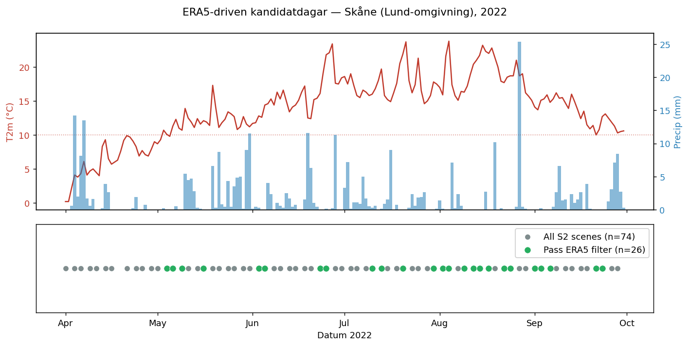
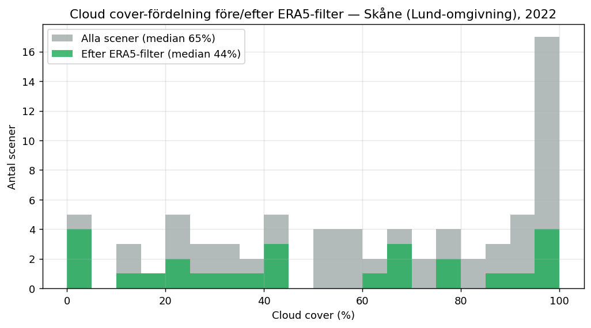
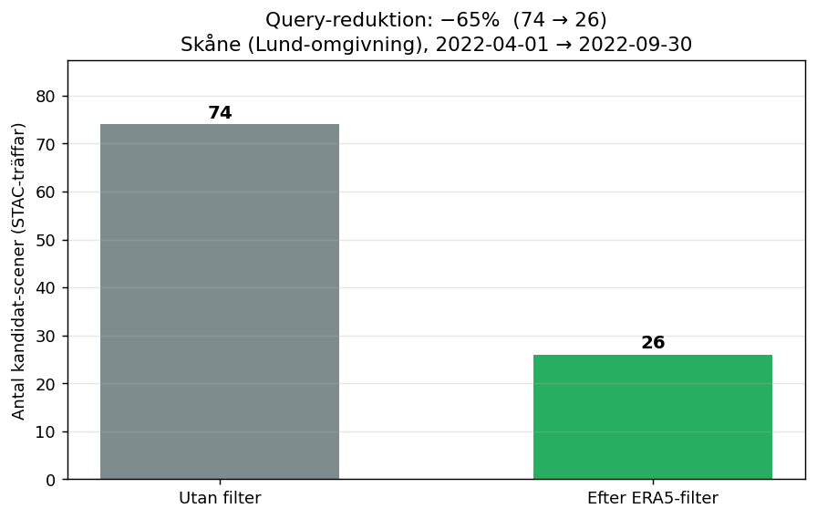

# ERA5-driven kandidatdags-filtrering för Sentinel-2-fetch

**Showcase — internt, space-ecosystem · ImintEngine · 2026-05-04**

Inspirerat av [erikkallman/metafilter](https://github.com/erikkallman/metafilter):
*"meteorological metadata can be used to narrow down when it is worth looking
for Sentinel-2 L2A imagery."*

Denna rapport visar vad mönstret skulle ge **vår** fetch-pipeline om vi använde
ERA5-väderdata som ett första urvalssteg innan STAC-search och asset-nedladdning.

---

## Frågan

Vår nuvarande pipeline (`imint/training/tile_fetch.py`,
`scripts/fetch_unified_tiles.py`) använder VPP-fenologi för att välja **fönster**
(start–slut för säsongsramar 1–3) men inom varje fönster söker vi alla S2-L2A-scener
via STAC och rankar på cloud cover.

> Hur mycket sparas om vi först filtrerar bort dagar där ERA5 säger
> "ostadigt väder eller utanför växtsäsong"?

## Setup

| Parameter | Värde |
|---|---|
| AOI | Skåne (Lund-omgivning), bbox `13.05, 55.65, 13.35, 55.80` (lat/lon) |
| Period | 2022-04-01 → 2022-09-30 (växtsäsong) |
| Scene-källa | Element84 earth-search STAC (`sentinel-2-l2a`, anonym) |
| Väderkälla | Open-Meteo Historical Archive (ERA5-baserad reanalys, daglig) |
| Filterregler | Daglig nederbörd ≤ 0.5 mm · föregående 2 dygn ≤ 3 mm · medel-T2m ≥ 10 °C |

Open-Meteo används här som öppet ERA5-substitut. Den **riktiga** integrationen
skulle använda samma Polytope/CDS-väg som befintliga
`imint/training/era5_aux.py` redan implementerar för aux-kanaler i träning.

## Resultat

| Mått | Värde |
|---|---|
| S2-scener i fönstret | **74** |
| Scener efter ERA5-filter | **26** |
| **Query-reduktion** | **−64.9 %** |
| Median cloud cover, alla scener | 64.8 % |
| Median cloud cover, efter filter | **44.4 %** |
| Medel cloud cover, alla scener | 60.9 % |
| Medel cloud cover, efter filter | **50.1 %** |
| Dagar i perioden | 183 |
| Dagar som passerar filtret | 61 |

### Tidsserie + kandidatdagar



Övre panel: dygnsmedeltemperatur (röd) med 10 °C-tröskeln streckad, samt
nederbörd (blå staplar). Undre panel: alla S2-scener (grå) och de som passerar
filtret (gröna). Urvalet följer de varma, torra perioderna i juni–augusti, vilket
är när modellen behöver flest cloud-free observationer.

### Cloud cover-fördelning



Den höga grå stapeln vid 95–100 % cloud cover (17 scener) är vad vi idag betalar
STAC-listning för utan att kunna använda. Den syns inte i grön stapel — filtret
identifierar dem korrekt.

### Query-reduktion



Per AOI och säsong: **74 → 26 STAC-träffar**. För full svensk rasteryta
(~7000 tiles enligt nuvarande unified_v2-domän) skulle det skala till
storleksordningen **>300 000 sparade STAC/asset-anrop per säsong**.

## Vad nyttan är

1. **Mindre last på CDSE/STAC.** Pipeline har redan
   `AdaptiveSemaphore` och `--max-per-hour` throttling i `tile_fetch.py` —
   reduktion *före* den punkten är direkt billigare än att backa av reaktivt.
2. **Bättre snittkvalitet på det som faktiskt processas.** Median cloud cover
   sjunker från 65 % till 44 %. Det betyder färre scener som listas, hämtas och
   sedan kasseras av downstream-QC i `build_labels.py` (`nodata > 5 %`-filtret).
3. **Förklarbar urvalslogik.** Idag är "varför just denna scen?" begravd i
   STAC-resultatet rankat på `eo:cloud_cover`. Med ERA5-prefiltret kan vi
   förklara: *"vi valde dessa dagar för att de hade torrt väder och aktiv
   växtsäsong — sen tog vi den med lägst cloud cover bland dem"*.
4. **Återanvänder befintlig infra.** `era5_aux.py` har redan Polytope-kod,
   point-batching och cache-mönster på plats. Prefiltret är ett nytt anrop på
   samma stack — inte en ny integration.

## Begränsningar

- **Open-Meteo ≠ ECMWF Polytope.** Open-Meteo är ERA5-baserat men passerar genom
  deras egen aggregering. För kund-/produktionsdemo ska vi använda Polytope
  direkt (samma som `era5_aux.py`).
- **Endast en AOI och ett år.** Skåne 2022 var en relativt torr säsong.
  Vintersäd-tunga regioner och blöta år (t.ex. 2023) kan ge svagare reduktion —
  värt att köra demo över ett urval AOI/år innan vi committar siffran.
- **ERA5-resolution är ~30 km.** Det är finare än våra 2.56 km tiles i den
  meningen att det är coarser, men eftersom väder är spatialt korrelerat över
  >10 km är det en korrekt avvägning för pre-filtrering.
- **Filterreglerna är inte tunade.** Vi valde tre lättförklarade trösklar.
  En riktig integration skulle kalibrera dem mot historisk
  observerad-cloud-cover för att maximera recall (behåll de få cloud-free
  dagarna som råkade vara fuktiga).

## Hur det skulle slottas in i fetch — kort

Detaljerat förslag i [`integration_proposal.md`](integration_proposal.md).
Sammanfattat: ett nytt steg mellan VPP-fönsterval och STAC-search, som tar
fönster + bbox och returnerar en glesare lista av kandidatdatum.

## Reproducera

```bash
python demos/era5_metafilter/replicate_metafilter.py
```

Första körningen träffar två publika API:er (~1.7 MB cache i `data/`).
Efterföljande körningar är fully offline. `metrics.json` regenereras varje gång
mot cachat data.

## Filer

```
demos/era5_metafilter/
├── REPORT.md                  ← denna fil
├── replicate_metafilter.py    ← runnable showcase
├── integration_proposal.md    ← fetch-pipelinen + ERA5-prefilter
├── metrics.json               ← maskinläsbara nyckeltal
├── data/
│   ├── stac_skane_2022.json   ← cachad STAC-respons
│   └── era5_skane_2022.json   ← cachad daglig ERA5
└── figures/
    ├── 01_candidate_days.png
    ├── 02_cloud_cover_dist.png
    └── 03_query_reduction.png
```
