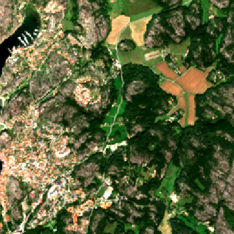
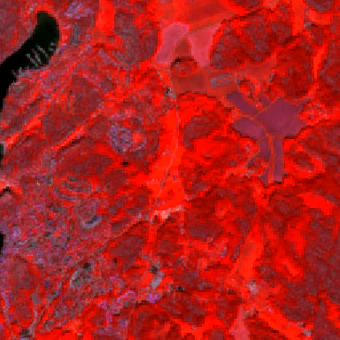
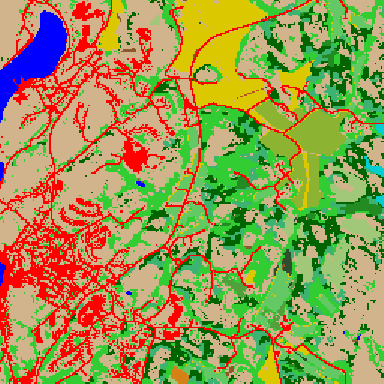
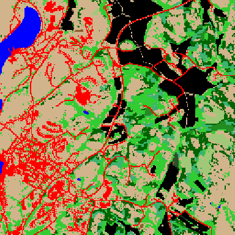
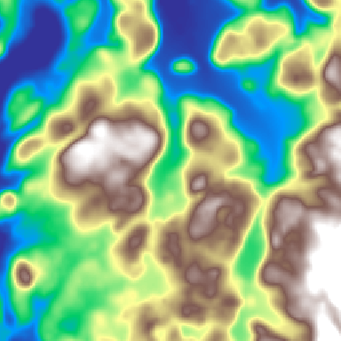
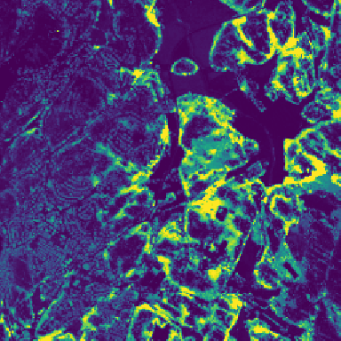
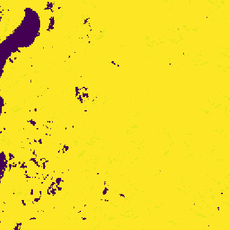
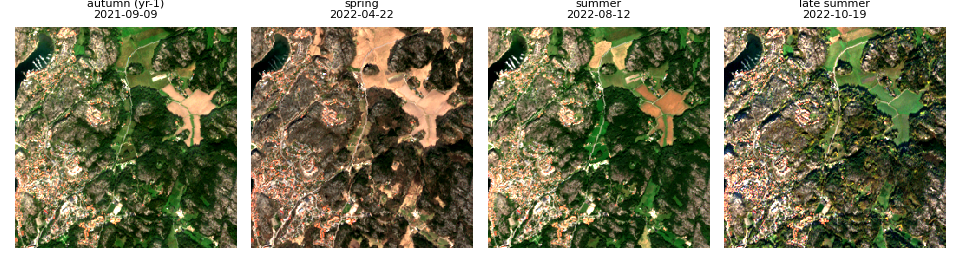
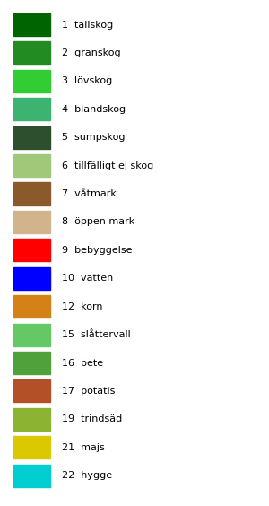

# ImintEngine — Unified v5 dataset (256 px)

Multitemporal Sentinel-2 + auxiliary geospatial tiles over Sweden for
**23-class LULC + harvest-readiness segmentation** (Prithvi-EO-2.0).

A machine-readable version of everything below is at
[`metadata.json`](metadata.json).

## At a glance

| | |
|---|---|
| Tiles | 8290 (`.npz`) |
| Total size | ~168 GB (~22 MB/tile) |
| Tile size | 256 × 256 px |
| GSD | 10 m |
| Extent | 2560 m × 2560 m |
| CRS | EPSG:3006 (SWEREF99 TM) |
| Schema version | v5 |

## Visual examples

One representative tile (`43983928`, a forest + agriculture mix). RGB and
NIR-CIR follow the standard viz parameters (B04/B03/B02 and B8A/B03/B04,
2–98 % stretch); see [`unified_v2_256.html`](unified_v2_256.html) for an
HTML version.

| True-colour RGB | NIR-CIR pseudocolour |
|:---:|:---:|
|  |  |
| Sentinel-2 B04/B03/B02 | B8A/B03/B04 — vegetation in red |

| Unified label (23 cls) | NMD base land cover |
|:---:|:---:|
|  |  |
| NMD + LPIS + SKS | Naturvårdsverket NMD |

| Elevation (DEM) | Forest canopy height |
|:---:|:---:|
|  |  |
| Copernicus DEM (terrain) | SLU Skogliga grunddata (viridis) |

| VPP start-of-season |
|:---:|
|  |
| Copernicus HR-VPP (viridis) |

**Multitemporal — 4 frames** (autumn yr-1 + 3 VPP-guided growing-season):



**Label legend** (classes present in this tile):



## Temporal frames

Each tile stacks **4 temporal frames × 6 bands** (`spectral`, shape
`(24, 256, 256)`):

- **Frame 0** — autumn (Sep–Oct) of *year − 1* (stubble / winter crops)
- **Frames 1–3** — VPP-phenology-guided growing-season windows, adapted
  per tile latitude

Band order (Prithvi-EO-2.0): **B02, B03, B04, B8A, B11, B12**
(note: NIR is **B8A**, not B08). Values are surface reflectance,
`float32`, nominal range ~[0.0, 0.4] — **feed raw reflectance to models,
do not percentile-stretch.**

> Spectral year **must** match the label year (LPIS/SKS); the autumn
> frame is from the label year minus 1.

## Label schema (23 classes)

`label`, shape `(256, 256)`, `uint8`, class 0 = `bakgrund` (ignore index).

| id | name | source | id | name | source |
|----|------|--------|----|------|--------|
| 0 | bakgrund | — | 12 | korn | LPIS |
| 1 | tallskog | NMD | 13 | havre | LPIS |
| 2 | granskog | NMD | 14 | oljeväxter | LPIS |
| 3 | lövskog | NMD | 15 | slåttervall | LPIS |
| 4 | blandskog | NMD | 16 | bete | LPIS |
| 5 | sumpskog | NMD | 17 | potatis | LPIS |
| 6 | tillfälligt ej skog | NMD | 18 | sockerbetor | LPIS |
| 7 | våtmark | NMD | 19 | trindsäd | LPIS |
| 8 | öppen mark | NMD | 20 | råg | LPIS |
| 9 | bebyggelse | NMD | 21 | majs | LPIS |
| 10 | vatten | NMD | 22 | hygge | SKS |
| 11 | vete | LPIS | | | |

## What's in each tile

Beyond `spectral` and `label`, each `.npz` carries an auxiliary stack.
The model input is **(4×6 spectral + 10 aux, H, W) = 34 channels**, where
the 10 aux are: `height`, `volume`, `basal_area`, `diameter` (SLU forest
metrics), `dem` (Copernicus DEM), and `vpp_sosd`, `vpp_eosd`, `vpp_length`,
`vpp_maxv`, `vpp_minv` (HR-VPP phenology).

> The synthetic `harvest_probability` channel was dropped (it leaked the
> harvest target into the input). The real SKS layer `harvest_mask` is
> kept. For NMD use `nmd_label_raw` (NMD 19-class, on every tile) — the
> legacy `nmd_label` key was removed (it didn't pixel-align with it).

Optional extras (present only when the paired `has_*` flag is set):
`rededge` (12 bands), `s1_vv_vh` (Sentinel-1), `tessera` (128-dim
embeddings), `frame_2016` (legacy autumn frame).

Plus per-tile scalars: `bbox_3006`, `easting`/`northing` (tile center),
`lpis_year`, `dates`, `doy`, parcel/harvest counts, etc.

**See [`metadata.json`](metadata.json) for the full per-array shape /
dtype / source table.**

## File naming

All tiles share one flat directory. There are two naming schemes:

| pattern | tile type | name encodes |
|---|---|---|
| `tile_<east>_<north>.npz` | LULC grid | EPSG:3006 tile-center coords |
| `crop_<crop>_<east>_<north>.npz` | LPIS crop centroid | crop name + coords |
| `urban_<east>_<north>.npz` | SCB tätort | coords |
| `<point_id>.npz` (e.g. `43983928.npz`) | legacy | a LUCAS-style point id |

Conventions and caveats:

- `crop_*` / `urban_*` are **flat-named prefixes, not folders**.
- The name is **not** the source of truth for location — every tile also
  stores `easting`, `northing`, and `bbox_3006` internally. The legacy
  point-id tiles carry their coords only inside the `.npz`.
- **The train/val/test split is `md5(filename) % 100`** (val < 10, test by
  latitude). A tile's *filename therefore determines its split* — so do
  **not** rename tiles, or you reshuffle the split and break
  reproducibility against the shared model. New builds should use the
  uniform `<type>_<east>_<north>.npz` form.

Bookkeeping files in the listing: `class_stats.json`, `manifest.json`,
`splits_summary.json`, `train.txt`, `val.txt`, `test.txt`.

## Loading

```python
import numpy as np
z = np.load("tile_281280_6471280.npz", allow_pickle=True)
spectral = z["spectral"]   # (24, 256, 256) float32
label    = z["label"]      # (256, 256) uint8, 0..22
```

Deterministic train/val split: `md5(filename) % 100 < 10` → val.

## Baseline model

A Prithvi-EO-2.0 **300M** checkpoint trained on this dataset is shared
alongside it as a **baseline / fine-tuning seed** (10 epochs, val mIoU
**0.4716** — not production-grade):

- `model/prithvi_300m_256_best.pt` (1.3 GB) · `model/training_log.json`
- Details, architecture, and loading: [`model/MODEL_CARD.md`](model/MODEL_CARD.md)

## Download

- Listing: <https://dataset-256.icedc.se/unified_v2/> (basic-auth)
- Schema: <https://dataset-256.icedc.se/metadata.json>
- Resumable bulk download: `scripts/download_unified_256.sh`

> ⚠️ This is a **temporary** ICE-hosted mirror (~48 h window). For a
> permanent copy, grab it before it's torn down.

## Sources & license

Derived from open data: ESA Copernicus Sentinel-2, Naturvårdsverket NMD,
Jordbruksverket LPIS/SJV, Skogsstyrelsen SKS, SLU, Copernicus DEM.
Redistribution is subject to the respective source licenses.
